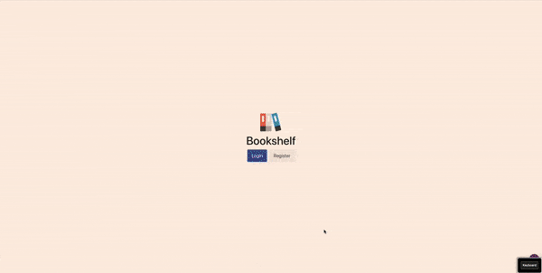

# Bookshelf

A Bookshelf App where a user can sort his favorite books into 3 shelves:

- Currently Reading
- finished

user flow :

- Search for a book
- books are loaded from Google book API
- load only 9 books and as the user scrolls down more books loads
- The main library page features basic info about every book
- A click on a 'Read more' link leads to a single book page view

features :

- create a new account / login and logout
- add a book to reading list
- remove a book from reading list
- mark a book as finished
- add rating & notes for a finished book
- unmark a book as read

## Live Version

[Click Here](https://bookshelf-20695.web.app/)

## Built With

- React (functional components, hooks, router)
- React Query (server state management )
- Firebase Auth
- firestore (save users and users' list )
- JavaScript (ES6)
- react-infinite-scroller libarary
- Base Web React UI framework
- Ramda
- Airbnb-typescript ESLint codestyle

## Contributors

👤 **Mohammed Al-Asfar**

- [GitHub](https://github.com/elasfarc)

## 🤝 Contributing

Contributions, issues and feature requests are welcome!

Feel free to check the [issues page](issues/).

## Show your support

Give a ⭐️ if you like this project!

## Thank you

Thank you for taking your time to view this project, we hope you enjoyed it! See you later in the next one!
